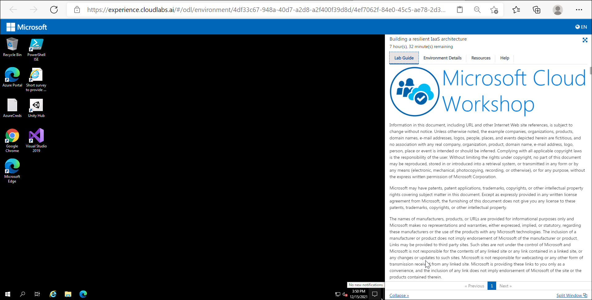
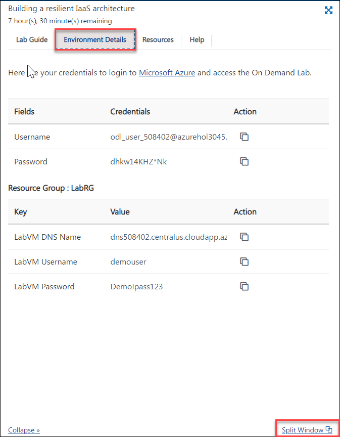

# Getting Started with Azure 

Duration: 10 mins

## Instructions

1. Once the environment is provisioned, a virtual machine (JumpVM) and lab guide will get loaded in your browser. Use this virtual machine throughout the workshop to perform the lab.

   

2. To get the lab environment details, you can select the **Environment Details** tab. Additionally, the credentials will also be sent to your email address provided during registration. Use the given username and password during sign-in.

   

3. You can also open the JumpVM and Lab Guide on Separate full window by selecting the **Split-Window** at the bottom right corner as shown in the above screenshot.

## Login to Azure Portal

1. Let us start by logging into the Azure Portal to check the resources deployed for the lab environment. In the virtual machine (VM) on the left, click on the Azure portal desktop icon as shown below.

   
   
1. When you click on Azure portal, the edge browser welcome screen will come up, select **Start without your data**.

   )
   
1. On the next window, click on **Confirm and start browsing**.

   [
   
1. Now, you will see two tabs in the edge browser, close the first tab named with **Microsoft Edge**.

1. On the **Sign in to Microsoft Azure** window, you will see the login screen, enter the following username and click on **Next**.

   * Email/Username: <inject key="AzureAdUserEmail"></inject>

   

1. Now enter the following password and click on **Sign in**. 

   * Password: <inject key="AzureAdUserPassword"></inject>
   
   

1. First-time users are often prompted to **Stay Signed In**, if you see any such pop-up, click on **No**

   

1. If you see the pop-up **You have free Azure Advisor recommendations!**, close the window to continue the lab.

1. If a **Welcome to Microsoft Azure** popup window appears, click **Maybe Later** to skip the tour.
  
